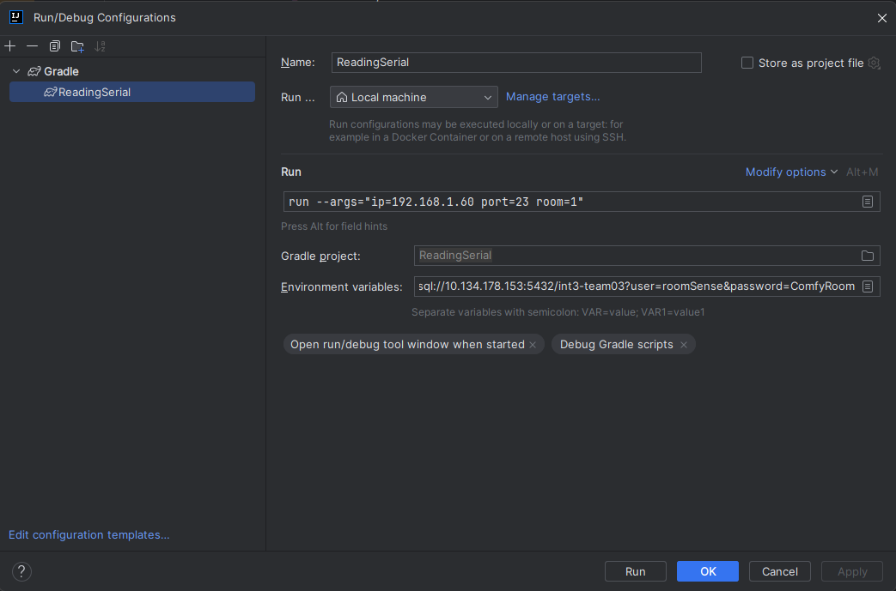

# ReadingSerial

In order to be able to run this program, you will need 1 environmental variable and 3 command line arguments.

- Environmental variables:
    - `rs_db_cred=jdbc:postgresql://10.134.178.153:5432/int3-team03?user=roomSense&password=ComfyRoom`
- Command Line Arguments:
    - ip=*deviceIP*
    - port=*devicePort*
    - room=*roomID*

In intellij you can go into edit configuration mode and input the variable and command line arguments as such:

For command line arguments: `run --args="ip=deviceIP port=devicePort room=roomID"`

### Other projects:
- SpringProject, main project used to host website and process data:
    - https://gitlab.com/kdg-ti/integration-2.1/23-24/group-3/springproject
- Arduino, project that houses both the arduino application and the application for the ESP8266
    - https://gitlab.com/kdg-ti/integration-2.1/23-24/group-3/arduino
